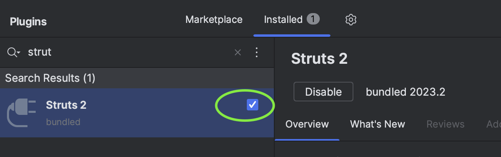

# Struts 2

Provides full integration of Apache Struts 2.

提供对 Apache Struts 2 的完整集成功能。本插件由 BeanSoft 友情维护，
<a href="https://plugins.jetbrains.com/organizations/BeanSoft">查看BeanSoft所有插件</a>。

## Usage under IDEA 2023.2.3

I've found this issue said this plugin is official abandoned:

https://youtrack.jetbrains.com/issue/IDEA-326596/Struts-2-Not-compatible-with-the-version-of-your-running-IDE-IntelliJ-IDEA-2023.2

This plugin is marked as disabled if you installed from disk. I've found a workaround, however, it might not work in the future:

1.  Unzip this file to disk, then will get a folder **struts2**.
2.  Copy this folder to IDEA's installation folder, eg: `/Applications/IntelliJ IDEA 2023.2.3.app/Contents/plugins`
3.  Restart IDE, and enable this plugin on the settings page:

Then it works for your project.

Chinese Instruction:

根据官方的issue，这个插件因为用户量太少，所以不再维护了：

https://youtrack.jetbrains.com/issue/IDEA-326596/Struts-2-Not-compatible-with-the-version-of-your-running-IDE-IntelliJ-IDEA-2023.2

这个插件如果你从磁盘直接安装，IDEA重启后会自动被禁用。我找到了一个临时方案来绕过（不过这个方案在将来可能会失效）：

1.  解压缩文件到磁盘后得到文件夹 **struts2**.
2.  将此文件夹复制到 IDEA 的安装目录下，例如, eg: `/Applications/IntelliJ IDEA 2023.2.3.app/Contents/plugins`
3.  重启开发工具, 然后在插件设置页启用这个插件:

然后在你的Struts 2项目中正常使用即可.